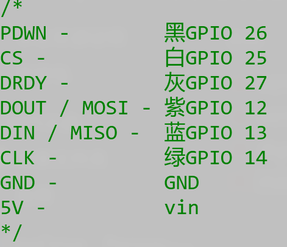

# ads1256 在 esp32 上的使用  

## 给出了我的引脚连线，在源代码库的基础上做了一点点更改，更加方便使用  

我的引脚连接（可以自行更改为你的引脚连接，只要在代码中做对应的修改即可）

esp32引脚连接

ads1256引脚连接

***注意，esp32的gnd和ads1256的gnd一定要相连，即一定要共地！！！***  

原作者代码参考：<https://github.com/YordanYanakiev/ADS1256>  
如有侵权，请联系删除
